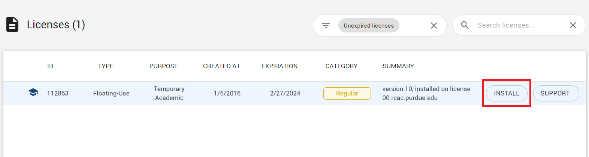
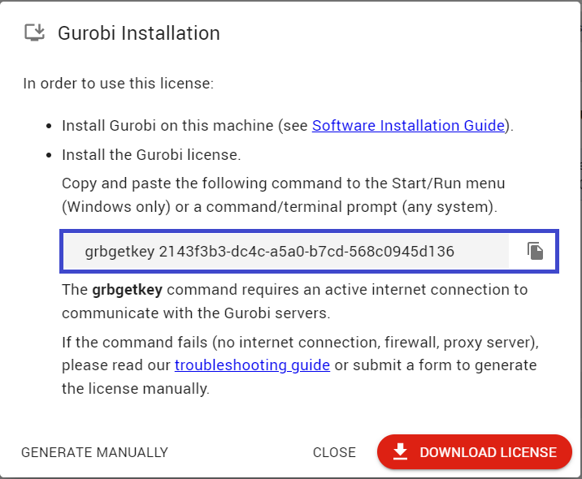
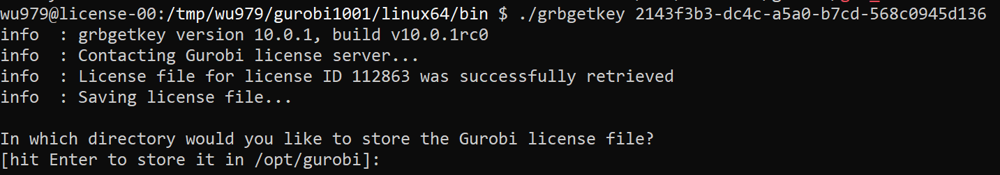
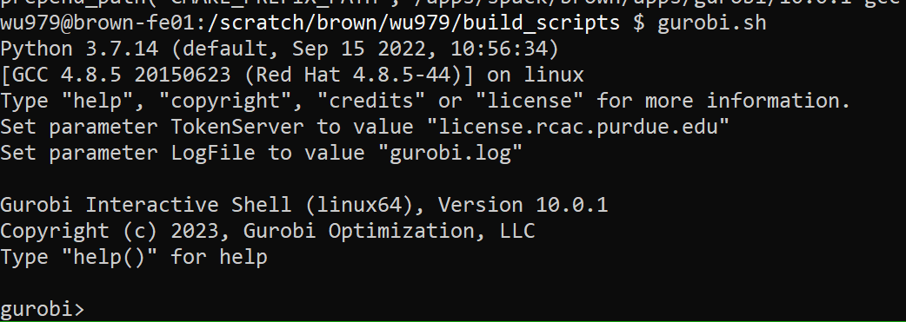

### 1. Gurobi Installation

- We can either  
  1) Manual install, just unpack the tarball into the install prefix  
  2) spack install

### 2. Gurobi License

- Academica license is free

- [gurobi.com](https://gurobi.com)  
  
  wu979@purdue.edu / puqUfreb9yu7&

-  Click on the INSTALL button 
      
    <!--  -->      
        
    
    And  
    
    <!--  -->  
         
    
-  Run `grbgetkey` on **license.rcac.purdue.edu** to generate **gurobi.lic** 
   and save it to `license.rcac.purdue.edu:/var/licenses/gurobi`
   
    <!--  -->  
      
  
- Git commit **gurobi.lic  grb_ts** into  
  `https://github.rcac.purdue.edu/RCAC-Staff/RCAC-CentOS-7-Configuration/tree/master/puppet/modules/license-00`  

### 3. Gurobi License Renewal

- Send email to `support@gurobi.com`  

   ```
   We would like to renew our site license (License ID 112863) for Purdue University shared HPC resources.
   
   Thanks
   XXX
   ```

- Gurobi response
  
  ```
  I have extented your Gurobi Academic Floating License for another year. To retrieve the updated license 
  file, log into your account on the Gurobi website, select License ID 112863no and rerun the grbgetkey code. 
  If you do not see this license ID, make sure you are logged onto the Gurobi website using xxx@purdue.edu. 
  
  The license is to be used for academic research and/or coursework related to academic studies. Any commercial 
  use is strictly forbidden.
  
  If you would like to upgrade to the newest version of Gurobi Optmizer please ensure that you have updated your 
  token server to the latest version. Below are the steps
  
  1. Stop the Gurobi token server (grb_ts)
  2. Install Gurobi Optmizer 10.0.1
  3. Refresh the license file via the command $ grbgetkey 2143f3b3-dc4c-a5a0-b7cd-568c0945d136
  4. Start the Gurobi token server $ GRB_LICENSE_FILE=gurobi.lic ./grb_ts
  
  For full instructions, see our Quick Start Guide.
  ```
  
### 4. Installation Steps

  1) spack install gurobi
  2) extract tarball into /tmp on **license.rcac** 
  3) `grbgetkey 2143f3b3-dc4c-a5a0-b7cd-568c0945d136` into **/var/licenses/gurobi**
  4) `cp /tmp/..../grb_ts /var/licenses/gurobi` 
  5) kill existing token server grb_ts and restart `GRB_LICENSE_FILE=gurobi.lic ./grb_ts &`  
  
  6) git commit gurobi.lic and grb_ts into **RCAC-CentOS-7-Configuration**  
     grb_ts is their actual license server (ts is token server)
     
  7) spack module lmod refresh gurobi 
  8) add `prepend_path("MATLABPATH", modroot.."/matlab", ":")` and `setenv("GRB_LICENSE_FILE", modroot.."/license/gurobi.lic")` into the modulefile and update modulefile in `xCAT-<Cluster>-Configuration` 
  9) Test `gurobi.sh`
     
     <!--  -->  
          
    
